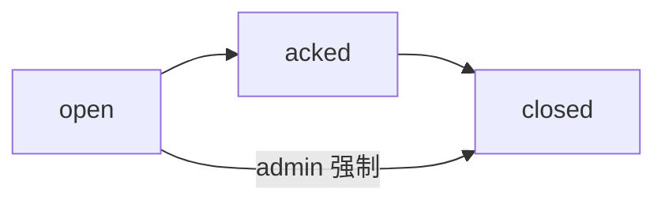

# 业务流程

> 演示虚构：DemoAlert 核心流程。

## 流程1：告警认领与关闭

### 流程概述
值班人员发现未认领告警后认领，处置完成后关闭并登记原因。

### 参与角色
- operator（主）
- viewer（只读关注）
- admin（升级处理）

### 正常流程
```
1. 系统产生或接收告警（状态=open，无处理人）
2. operator 在列表筛选本组织 open 告警并打开详情
3. operator 点击「认领」→ 状态=acked，记录处理人与时间
4. operator 处置外部问题后点击「关闭」
5. 填写关闭原因分类与备注 → 状态=closed
6. viewer 可在列表看到 closed 记录（只读）
```

### 异常流程
#### 异常1：重复认领
```
1. 告警已被他人认领
2. 系统拒绝第二次认领，提示当前处理人
3. 页面保持详情只读操作（除 admin 可转派——演示可标 P1）
```

#### 异常2：无权限关闭
```
1. viewer 调用关闭
2. 返回 403；UI 不展示关闭按钮
```

#### 异常3：关闭缺少原因
```
1. 提交关闭但原因分类为空
2. 校验失败，保持 acked，提示必填
```

### 业务规则
- 仅 `open` 可认领；仅 `acked` 可关闭（admin 可强制关闭 open——P1）
- 关闭必须选择原因分类：误报 / 已修复 / 转交 / 其他
- 数据范围：operator/viewer 仅本组织；admin 全部

### 数据流转
```
告警事件 → BizEntity(告警) → 认领/关闭事件(BizEvent) → 列表/导出
```



---

## 流程2：登录访问受保护资源

### 流程概述
未登录用户访问告警台时跳转登录，成功后回到原页面。

### 参与角色
- 全角色

### 正常流程
```
1. 用户打开 /biz
2. 无 Token → /login?redirect=/biz
3. 登录成功签发 Token → 跳转 redirect
```

### 异常流程
#### 异常1：账号停用
```
1. 登录失败提示「账号已停用」
2. 不签发 Token
```

### 业务规则
- 密码不落日志；失败可审计（P1）

---

> 💡 AI 提示：可继续推导转派、批量关闭等 P2 流程。
