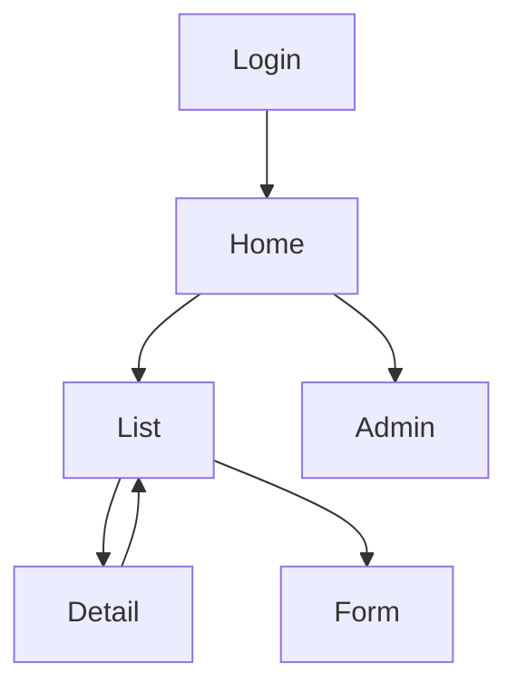

# 页面设计

> **DemoAlert（S02 模板深化）**。线框放 `08-prototype/`。

## 1. 页面清单

| 页面 ID | 页面名称 | 路由 | 主要角色 | 关联功能 | 优先级 |
|---------|----------|------|----------|----------|--------|
| P-LOGIN | 登录页 | `/login` | 全员 | F-001 | P0 |
| P-HOME | 工作台 | `/` | 全员 | 未关闭数概览 | P0 |
| P-LIST | 告警列表 | `/alerts` | operator, viewer, admin | F-002 | P0 |
| P-DETAIL | 告警详情 | `/alerts/:id` | 同上 | F-003/004/005 | P0 |
| P-FORM | 手工建告警 | `/alerts/new` | operator, admin | F-006 | P1 |
| P-RPT | 导出/简单统计 | `/alerts/export` | operator, admin | F-007 | P1 |
| P-ADMIN | 用户与角色 | `/admin/users` | admin | 用户管理 | P1 |

## 2. 跳转关系

```
登录 → 工作台
工作台 → 告警列表 / 系统管理
告警列表 → 详情（认领/关闭）→ 返回列表
告警列表 → 新建（P1）
未登录 → /login?redirect=…
无权限 → 403 提示
```



## 3. 关键页面

### P-LIST 告警列表
- **区块**: 状态筛选（open/acked/closed）/ 关键字 / 表格 / 分页
- **操作**: 进入详情；operator 可「认领」（行内或详情）；导出入口（P1）
- **权限**: `biz:alert:read`；写需 `biz:alert:write`

### P-DETAIL 告警详情
- **区块**: 基本信息（级别/状态/组织/处理人）/ 事件时间线 / 操作区
- **操作**: 认领（open）/ 关闭（acked，原因必填）/ 返回

### P-HOME 工作台
- **区块**: 本组织 open / acked 计数卡片 + 入口链到列表预筛选

## 4. 全局交互约定

| 项 | 约定 |
|----|------|
| 空状态 | 「暂无告警」+ 新建（有权限时） |
| 加载 | 表格 loading |
| 错误 | Toast + 可重试；401 → 登录 |
| 面包屑 | 工作台 › 告警 › 详情 |

## 5. 验收检查

- [x] P0 功能均有页面映射
- [x] 列表 ↔ 详情闭环
- [x] viewer 无写按钮
