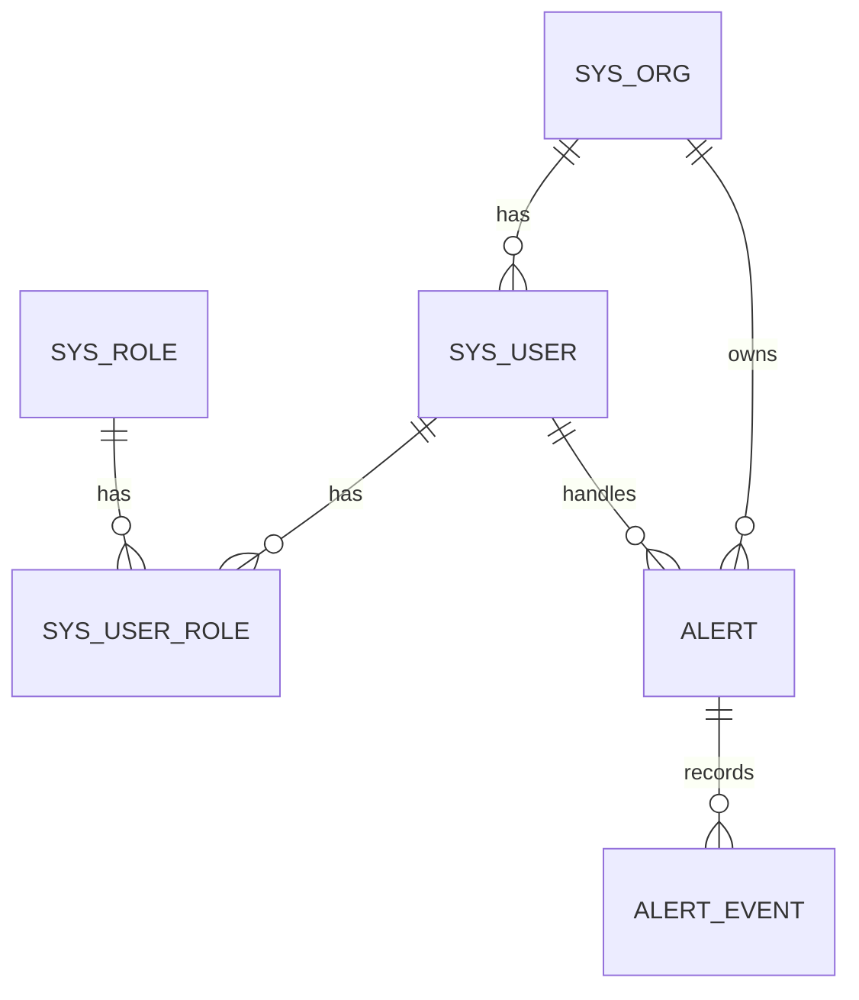

# ER 关系图

> **DemoAlert（S02）**

## Mermaid

## 关系说明

| 从 | 到 | 基数 | 删除策略 |
|----|----|------|----------|
| sys_org | sys_user | 1:N | RESTRICT |
| sys_user | sys_role | N:N | RESTRICT |
| sys_org | alert | 1:N | RESTRICT |
| alert | alert_event | 1:N | RESTRICT |
| sys_user | alert.owner_id | 1:N | SET NULL 可选 / RESTRICT |

## 验收
- [x] 与表设计一致
