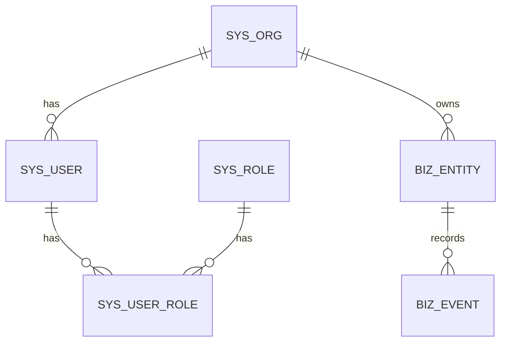

# ER 关系图

## Mermaid（骨架）

## 关系说明

| 从 | 到 | 基数 | 删除策略 |
|----|----|------|----------|
| org | user | 1:N | RESTRICT |
| user | role | N:N | RESTRICT |
| entity | event | 1:N | RESTRICT |

## 验收
- [ ] 与 `01-table-design.md` 表名一致
- [ ] 原图可存 `diagrams/`（若有）
